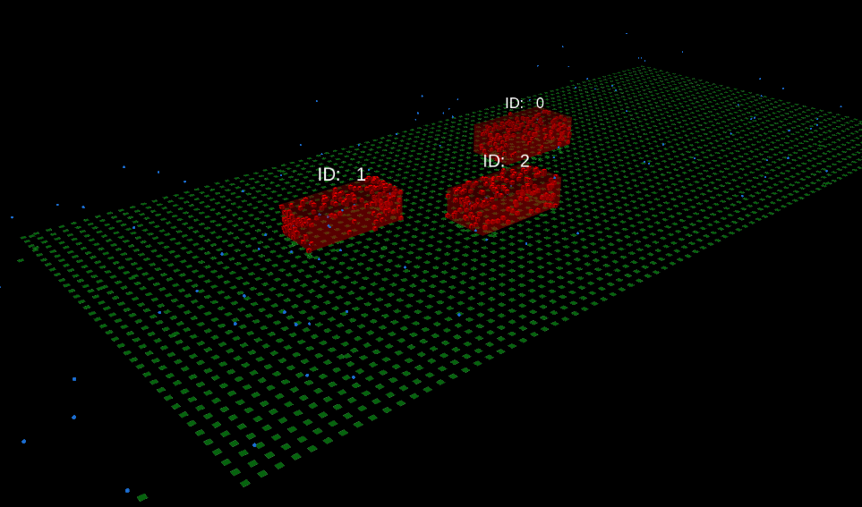
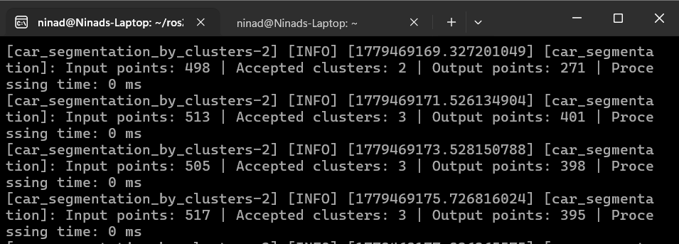

```markdown
# ROS2 Point Cloud Perception Suite

A modular ROS 2 Humble perception pipeline for point cloud preprocessing, ground segmentation, Euclidean clustering, 3D bounding-box visualization, and centroid-based object tracking using PCL and RViz2.

This project is designed as a robotics perception portfolio project, demonstrating a complete PointCloud2 processing workflow from raw/synthetic input data to clustered object visualization and persistent tracking IDs.

> Originally adapted from [CDonosoK/ros2_pcl_segmentation](https://github.com/CDonosoK/ros2_pcl_segmentation) under the BSD-3-Clause license.

---

## Overview

**ROS2 Point Cloud Perception Suite** processes `sensor_msgs/msg/PointCloud2` data through a modular ROS 2 pipeline. The system supports synthetic demo data publishing, point cloud preprocessing, ground plane removal, Euclidean clustering, RViz2 visualization, and frame-to-frame object tracking.

The pipeline is intended for robotics perception development, autonomous vehicle prototyping, and LiDAR algorithm experimentation on ROS 2 Humble.

---

## Demo

The perception pipeline supports:

- synthetic PointCloud2 generation
- preprocessing and filtering
- ground segmentation
- Euclidean clustering
- 3D RViz2 bounding boxes
- persistent tracking IDs

Example RViz2 output:



---
## Architecture

```text
Synthetic / KITTI PointCloud2 Input
              |
              v
   /kitti/point_cloud
              |
              v
   Point Cloud Preprocessing
              |
              v
   Ground Plane Segmentation
              |
              v
   Euclidean Clustering
              |
              v
   3D Bounding Box Generation
              |
              v
   Centroid-based Object Tracking
              |
              v
   RViz2 Visualization + Metrics Logging
```

---

## ROS 2 Packages

```text
ros2_pcl_segmentation/
├── pcl_car_segmentation/       # Clustering, bounding boxes, tracking, launch integration
├── pcl_ground_segmentation/    # Ground plane removal
├── pcl_preprocessing/          # Point cloud filtering and preprocessing
├── pcl_demo_data/              # Synthetic PointCloud2 demo publisher
├── README.md
└── LICENSE
```

---

## Features

- Synthetic `PointCloud2` demo publisher
- Point cloud preprocessing
- Ground plane removal
- Euclidean clustering
- 3D bounding boxes in RViz2
- Persistent tracking IDs across frames
- Runtime performance metrics logging
- Configurable YAML parameters
- Unified ROS 2 launch system
- RViz visualization support

---

## Key Engineering Highlights

- Modular ROS 2 multi-package architecture
- Real-time PointCloud2 processing pipeline
- Parameterized perception stack using YAML configs
- Centroid-based multi-object tracking
- RViz2 visualization with 3D bounding boxes and persistent IDs
- Synthetic perception simulation for reproducible testing
- Runtime performance instrumentation for profiling

---

## Technologies Used

- ROS 2 Humble
- Ubuntu 22.04
- PCL
- RViz2
- `sensor_msgs/msg/PointCloud2`
- ROS 2 launch system
- Python ROS 2 nodes
- C++/PCL perception components

---

## Installation

Install ROS 2 Humble and required development tools:

```bash
sudo apt update
sudo apt install ros-humble-desktop python3-colcon-common-extensions python3-rosdep
```

Initialize `rosdep` if needed:

```bash
sudo rosdep init
rosdep update
```

Clone the repository into a ROS 2 workspace:

```bash
mkdir -p ~/ros2_ws/src
cd ~/ros2_ws/src
git clone <your-repository-url> ros2_pcl_segmentation
cd ~/ros2_ws
```

Install dependencies:

```bash
rosdep install --from-paths src --ignore-src -r -y
```

---

## Build

From the workspace root:

```bash
cd ~/ros2_ws
colcon build
source install/setup.bash
```

To rebuild only the project packages:

```bash
colcon build --packages-select \
  pcl_car_segmentation \
  pcl_ground_segmentation \
  pcl_preprocessing \
  pcl_demo_data
```

---

## Launch

Run the full perception pipeline:

```bash
ros2 launch pcl_car_segmentation perception_pipeline.launch.py
```

The pipeline expects input point cloud data on:

```text
/kitti/point_cloud
```

---

## Synthetic Demo Workflow

Terminal 1: start the synthetic PointCloud2 publisher.

```bash
source ~/ros2_ws/install/setup.bash
ros2 run pcl_demo_data synthetic_pointcloud_publisher
```

Terminal 2: launch the perception pipeline.

```bash
source ~/ros2_ws/install/setup.bash
ros2 launch pcl_car_segmentation perception_pipeline.launch.py
```

The synthetic publisher generates:

- ground plane points
- 3 car-like cuboid point clusters
- sparse random noise points

Published topic:

```text
/kitti/point_cloud
```

Frame ID:

```text
map
```

---

## RViz2 Visualization

Launch the perception pipeline and open RViz2 if it is not started automatically:

```bash
rviz2
```

Recommended RViz2 displays:

- `PointCloud2` input cloud
- filtered/preprocessed point cloud
- segmented non-ground cloud
- clustered objects
- 3D bounding boxes
- tracking ID markers

Set the fixed frame to:

```text
map
```

---

## Performance Metrics

The pipeline includes runtime performance metrics logging for perception stages. These metrics are useful for evaluating frame processing time, clustering behavior, and tracking performance during development.

Example runtime output:

```text
Input points: 517 | Accepted clusters: 3 | Output points: 409 | Processing time: 0 ms
```
---

## Screenshots and GIFs

```markdown



```
---

## Future Improvements

- Add automated launch tests
- Add benchmark scripts for repeatable performance evaluation
- Add configurable tracking association thresholds
- Add saved RViz2 configuration profiles
- Add support for recorded rosbag demo playback
- Improve documentation for tuning YAML parameters

---

## License and Attribution

This project was originally adapted from:

[CDonosoK/ros2_pcl_segmentation](https://github.com/CDonosoK/ros2_pcl_segmentation)

The original project is licensed under the BSD-3-Clause license. This repository preserves that attribution and builds on the original ROS 2 PCL segmentation foundation with additional demo, launch, visualization, tracking, and metrics workflow improvements.
```